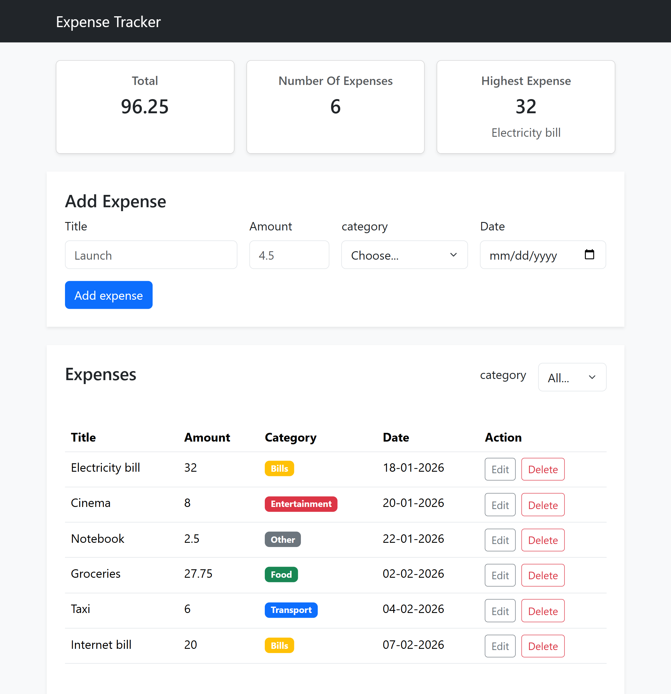
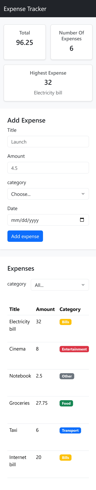
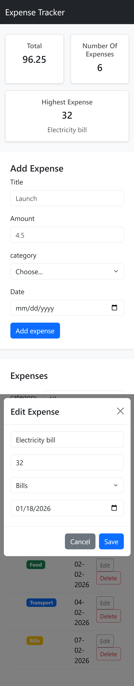

# Expense Tracker

Expense Tracker is a full-stack web application for managing personal expenses.

The application uses a Bootstrap frontend connected directly to a REST API built with Node.js and Express. Expense data is stored and managed in PostgreSQL.

## How to run

**Backend**

1. Open the `backend` folder in VS Code.

2. Install the required dependencies:

  `npm install`

3. Create a PostgreSQL database named:

  `tracker_expense`

4. Run schema.sql in PostgreSQL to create the expenses table and insert the initial data.

5. Create a .env file in the backend folder and add your PostgreSQL connection details:

DB_HOST=localhost
DB_PORT=5432
DB_USER=postgres
DB_PASSWORD=your_password
DB_NAME=tracker_expense

6. Start the backend:

  `npm run dev`

7. The backend will run at:

   http://localhost:3000

   
**Frontend**

1. Open the `frontend` folder in VS Code.

2. Make sure the backend server is running.

3. Open `index.html` using VS Code Live Server.

4. The frontend will connect to the backend API at:

   `http://localhost:3000/api/expenses`

## Features

- [x] Add an expense (with validation)
- [x] Delete an expense
- [x] Edit an expense
- [x] Filter by category
- [x] Summary cards (total, count, highest)
- [x] Data is saved in a PostgreSQL database

## Screenshots

### Desktop View

### Mobile View

### Edit Expense Modal

## What was the hardest part?

The hardest part was connecting the frontend to the backend API and handling asynchronous operations correctly. I had to understand how `fetch`, `async/await`, HTTP status codes, JSON responses, validation, and error handling work together. I solved this by testing each API operation separately and then connecting it to the frontend using `try/catch`, validation messages, and refreshing the data from the server after each successful operation.

## GitHub Repository

https://github.com/SAlskafi/expense-tracker